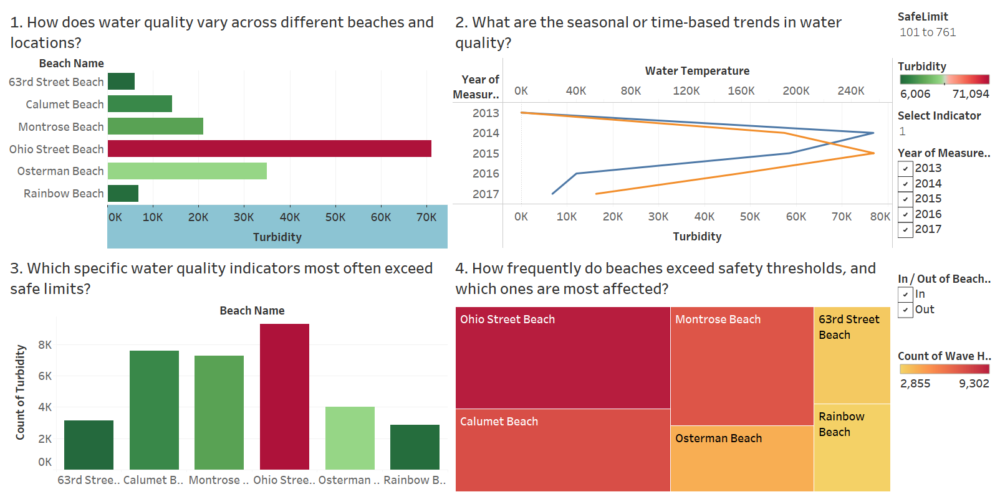
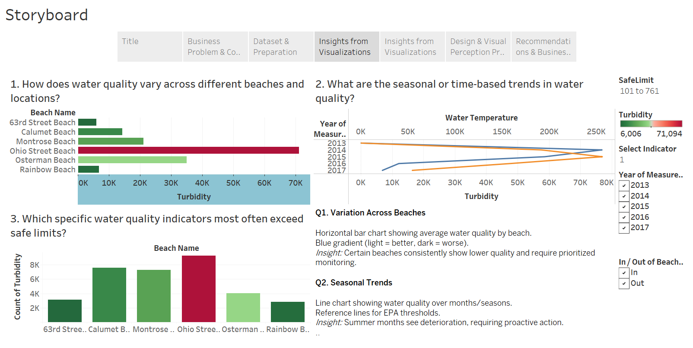
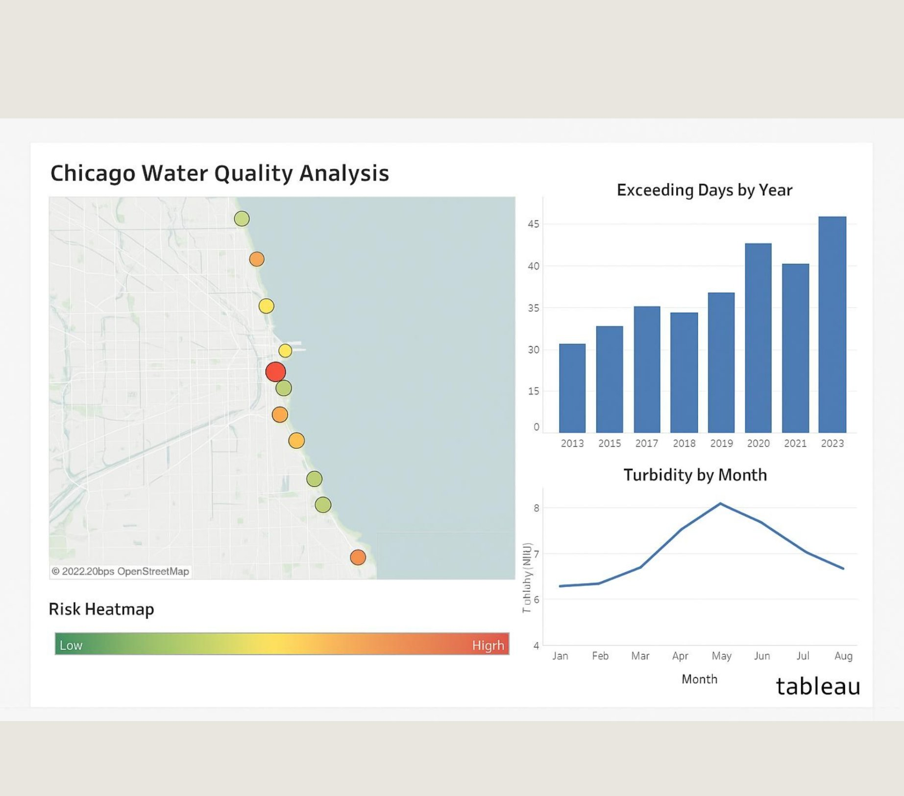

# 🏖️ Chicago Beach Water-Quality Dashboard

An interactive dashboard and data story built on the **City of Chicago's automated beach water-quality sensor data** — translating raw sensor readings into clear, public-facing answers about when and where it's safe to swim.



## Business Problem
Chicago's beaches are monitored by automated sensors tracking water-quality indicators. But raw sensor data doesn't help a beachgoer decide whether to swim today — or help officials decide when to issue advisories. This project bridges that gap with visual design grounded in perceptual principles and a storyboard that answers five decision-driven questions.

## The Five Questions
1. **Beach rankings** — how does water quality vary across beaches?
2. **Seasonal & time-based trends** — when is water quality best and worst?
3. **Safety exceedances** — which indicators breach safe limits?
4. **Exceedance frequency** — a heatmap of how often each beach exceeds limits.
5. **Environmental drivers** — how do temperature, rainfall, and tides relate to water quality? (correlations + trendlines)

## Design Approach
Dashboard design follows **Gestalt principles of visual perception**:
- **Contrast** to draw the eye to exceedances and alerts
- **Alignment** for a clean, scannable layout
- **Proximity** to group related metrics
- **Similarity** for consistent encoding across views

The Week 7 storyboard turns the analysis into a guided narrative — each view builds on the last so a non-technical audience reaches the same conclusions as the analyst.





## Data
City of Chicago beach water-quality automated-sensor readings (public data, via data.world): timestamped measurements of key water-quality indicators across Chicago's beaches.

## Tools
`Tableau` · `data.world` · Dashboard design · Data storytelling

## Repository Structure
```
├── assets/
│   ├── chicago-dashboard-4panel.png   # Four-panel Tableau dashboard (Q1–Q4)
│   ├── chicago-storyboard.png         # Tableau storyboard with story points
│   └── chicago-risk-heatmap.png       # Risk heatmap: shoreline map + exceedance & turbidity charts
├── docs/     # Capstone write-ups
│   ├── business-analytics-capstone-week-6-assignment-dinisha-denuka.docx  # Design & Gestalt principles
│   └── business-analytics-capstone-week-7-assignment-dinisha-denuka.docx  # Storyboard & five business questions
└── README.md
```

*Completed as the Business Analytics Capstone at Trine University.*
